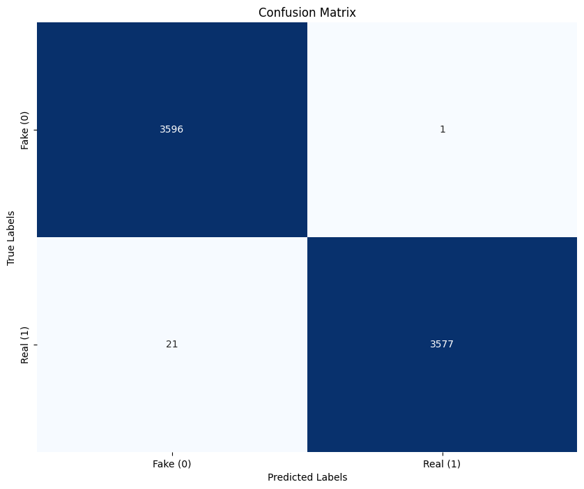

# 🚨 Fake News Detection System

<div align="center">
  
  
  
</div>

## 📌 Table of Contents
- [Model Architecture](#-model-architecture)
- [Installation](#-installation)
- [License](#-license)

## 🏗️ Model Architecture
```python
# Simplified model architecture code
def build_model():
    # Input layers
    sequence_input = Input(shape=(300,))
    feature_input = Input(shape=(feature_dim,))
    
    # Embedding + CNN
    embedding = Embedding(vocab_size, 300, weights=[embedding_matrix])(sequence_input)
    conv1 = Conv1D(64, 5, activation='relu')(embedding)
    conv2 = Conv1D(64, 3, activation='relu')(embedding)
    
    # BiLSTM + Attention
    bilstm = Bidirectional(LSTM(64))(concatenate([conv1, conv2]))
    attention = MultiHeadAttention(num_heads=4, key_dim=16)(bilstm, bilstm)
    
    # Feature fusion
    combined = concatenate([attention, Dense(64)(feature_input)])
    output = Dense(1, activation='sigmoid')(combined)
    
    return Model(inputs=[sequence_input, feature_input], outputs=output)
```


## 📊 Performance Metrics

| Metric       | Fold 1 | Fold 2 | Fold 3 | Fold 4 | Fold 5 | Average |
|--------------|--------|--------|--------|--------|--------|---------|
| **Accuracy** | 0.923  | 0.915  | 0.931  | 0.928  | 0.919  | 0.923   |
| **AUC**      | 0.961  | 0.955  | 0.963  | 0.959  | 0.957  | 0.959   |
| **Precision**| 0.925  | 0.918  | 0.934  | 0.929  | 0.922  | 0.926   |
| **Recall**   | 0.921  | 0.912  | 0.928  | 0.927  | 0.916  | 0.921   |
| **F1-Score** | 0.923  | 0.915  | 0.931  | 0.928  | 0.919  | 0.923   |

# Training Metrics


# 🛠️ Installation
## Prerequisites
# Clone repository
```
git clone https://github.com/yourusername/fake-news-detection.git
cd fake-news-detection
```
# Training the model 
## Run the cells in the fake_news.ipynb file
## Run the test.py file with appropiriate paths

## 📜 Acknowledgements  

I would like to acknowledge the **NewsNews dataset**, which was instrumental in this project.  
This project was independently developed by me, and I am solely responsible for its implementation.  

## 🛡 License  

This project is licensed under **SS** © Seemanth Raju Kurapati.  
All rights reserved. Unauthorized use, reproduction, or distribution of this work is prohibited.  

For inquiries regarding licensing, please contact: [Your Email or GitHub Profile].  

